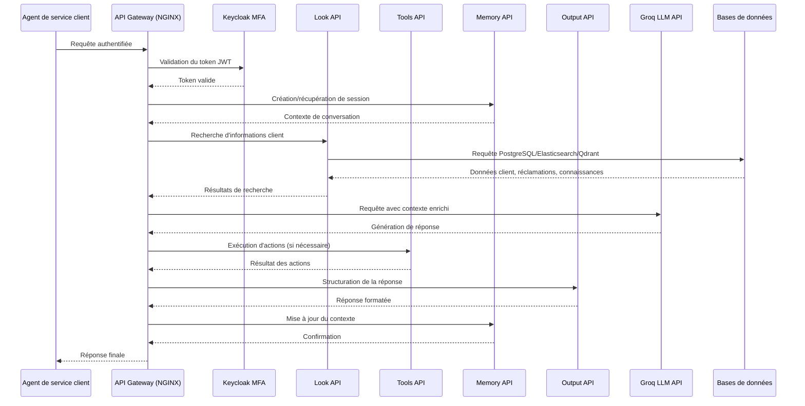

```mermaid
sequenceDiagram
    participant Agent as Agent de service client
    participant Gateway as API Gateway (NGINX)
    participant Auth as Keycloak MFA
    participant Look as Look API
    participant Tools as Tools API
    participant Memory as Memory API
    participant Output as Output API
    participant LLM as Groq LLM API
    participant DB as Bases de données

    Agent->>Gateway: Requête authentifiée
    Gateway->>Auth: Validation du token JWT
    Auth-->>Gateway: Token valide
    
    Gateway->>Memory: Création/récupération de session
    Memory-->>Gateway: Contexte de conversation
    
    Gateway->>Look: Recherche d'informations client
    Look->>DB: Requête PostgreSQL/Elasticsearch/Qdrant
    DB-->>Look: Données client, réclamations, connaissances
    Look-->>Gateway: Résultats de recherche
    
    Gateway->>LLM: Requête avec contexte enrichi
    LLM-->>Gateway: Génération de réponse
    
    Gateway->>Tools: Exécution d'actions (si nécessaire)
    Tools-->>Gateway: Résultat des actions
    
    Gateway->>Output: Structuration de la réponse
    Output-->>Gateway: Réponse formatée
    
    Gateway->>Memory: Mise à jour du contexte
    Memory-->>Gateway: Confirmation
    
    Gateway-->>Agent: Réponse finale
```
