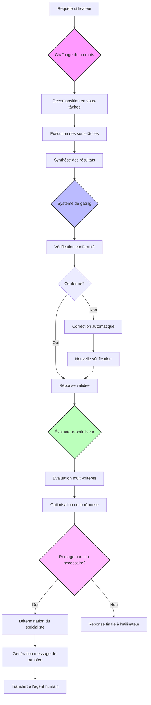

```mermaid
flowchart TD
    A[Requête utilisateur] --> B{Chaînage de prompts}
    B --> C[Décomposition en sous-tâches]
    C --> D[Exécution des sous-tâches]
    D --> E[Synthèse des résultats]
    
    E --> F{Système de gating}
    F --> G[Vérification conformité]
    G --> H{Conforme?}
    H -->|Non| I[Correction automatique]
    I --> J[Nouvelle vérification]
    H -->|Oui| K[Réponse validée]
    J --> K
    
    K --> L{Évaluateur-optimiseur}
    L --> M[Évaluation multi-critères]
    M --> N[Optimisation de la réponse]
    
    N --> O{Routage humain nécessaire?}
    O -->|Oui| P[Détermination du spécialiste]
    P --> Q[Génération message de transfert]
    Q --> R[Transfert à l'agent humain]
    O -->|Non| S[Réponse finale à l'utilisateur]
    
    style B fill:#f9f,stroke:#333,stroke-width:2px
    style F fill:#bbf,stroke:#333,stroke-width:2px
    style L fill:#bfb,stroke:#333,stroke-width:2px
    style O fill:#fbf,stroke:#333,stroke-width:2px
```
